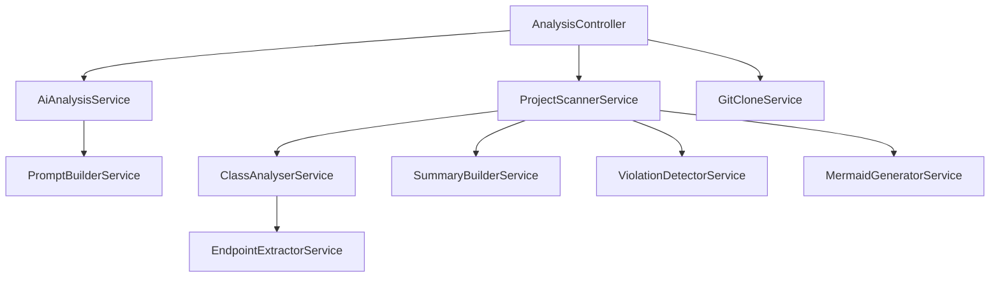

# AI Codebase Analyzer

**AI-powered architecture analysis for Spring Boot projects.**

> Built as a portfolio project demonstrating AI-native Java engineering — LLM integration, static analysis, prompt engineering, and full-stack delivery.


Paste a Git URL or local path, get a full architecture report with scores, violation detection, coupling analysis, and an AI-generated assessment — in seconds.

---

## What It Does

- **Scans any Spring Boot project** — provide a local file path or a public Git URL. The tool clones, scans, and cleans up automatically.
- **Extracts architecture metadata** — uses JavaParser to analyze class hierarchies, dependencies, endpoints, annotations, and package structure. Detects Spring Data JPA repositories, controller inheritance, and more.
- **Detects architectural violations** — layer violations, circular dependencies, god classes, fat controllers, orphan services, empty controllers, and coupling hotspots.
- **Generates AI-powered analysis** — sends structured metadata to an LLM, which returns a scored assessment with specific, actionable feedback referencing your actual class names.

---

## How to Run

### Option 1: Docker

```bash
docker build -t ai-codebase-analyzer .
docker run -p 8080:8080 ai-codebase-analyzer
```

To analyze a local project from inside Docker, mount it as a volume:

```bash
docker run -p 8080:8080 -e OPENAI_API_KEY=sk-your-key -v /path/to/project:/scan ai-codebase-analyzer
```

Then use `/scan` as the project path in the UI.

### Option 2: Local (Maven)

Requires Java 21.

```bash
./mvnw spring-boot:run
```

### Then

Open **http://localhost:8080** and enter a project path or Git URL.

**Example inputs:**
```
D:\dev\projects\my-spring-app
https://github.com/spring-projects/spring-petclinic.git
```

---

## What It Detects

| Detection | Description |
|---|---|
| **Layer Violations** | Controller directly accessing a repository, service depending on a controller, configuration depending on a controller |
| **Circular Dependencies** | A depends on B, B depends on A |
| **God Classes** | Classes with more than 5 project dependencies or more than 10 methods |
| **Fat Controllers** | Controllers with more than 6 endpoints |
| **Empty Controllers** | Controllers with no mapped endpoints |
| **Orphan Services** | Services not injected by any other class |
| **Coupling Ranking** | Top 3 most coupled classes by incoming + outgoing project dependencies |
| **Spring Data Repositories** | Detects interfaces extending JpaRepository, CrudRepository, MongoRepository, etc. |
| **Hierarchy Detection** | Two-pass detection resolves component types through class inheritance and interface chains |

---

## Tech Stack

| | |
|---|---|
| **Language** | Java 21 |
| **Framework** | Spring Boot 3.5 |
| **AST Parsing** | JavaParser |
| **AI** | OpenAI API via Spring AI |
| **Git Cloning** | JGit |
| **Diagrams** | Mermaid.js (CDN) |
| **API Docs** | SpringDoc OpenAPI (Swagger) |
| **Containerization** | Docker (multi-stage build) |

---

## Architecture

This is the architecture diagram generated by the tool scanning itself:



Controllers → Services → Extractors (left to right = entry point to leaf)

---

## API Documentation

Swagger UI is available at:

```
http://localhost:8080/swagger-ui/index.html
```

OpenAPI spec:

```
http://localhost:8080/v3/api-docs
```

### Endpoints

| Method | Path | Description |
|---|---|---|
| `POST` | `/analyse` | Returns raw analysis (no AI) |
| `POST` | `/analyse/ai` | Returns full analysis with AI report |

**Parameters** (query string, provide one):
- `projectPath` — absolute path to a local project
- `repoUrl` — Git URL to clone and analyze

**Example:**
```bash
curl -X POST "http://localhost:8080/analyse/ai?repoUrl=https://github.com/spring-projects/spring-petclinic.git"
```

---

## Configuration

The API key is **never committed to Git**. Three options:

### Option A: Local profile (recommended)

Create `src/main/resources/application-local.yaml`:

```yaml
spring:
  ai:
    openai:
      api-key: sk-your-actual-key
```

This file is in `.gitignore`. Activate the profile in your IDE run config or via command line:

```bash
SPRING_PROFILES_ACTIVE=local ./mvnw spring-boot:run
```

### Option B: Environment variable

```bash
export OPENAI_API_KEY=sk-your-actual-key
./mvnw spring-boot:run
```

### Option C: Docker

```bash
docker run -p 8080:8080 -e OPENAI_API_KEY=sk-your-actual-key ai-codebase-analyzer
```

---

## Project Structure

```
src/main/java/com/isbrain/codebaseanalyzer/
  controller/        REST endpoints
  service/           Core analysis logic
    ClassAnalyserService       JavaParser-based class analysis
    ProjectScannerService      Orchestrates the full scan pipeline
    ViolationDetectorService   Architectural violation detection
    MermaidGeneratorService    Diagram generation
    SummaryBuilderService      Statistics and relationship building
    GitCloneService            JGit-based repo cloning
    AiAnalysisService          LLM integration
    EndpointExtractorService   REST endpoint extraction
  prompt/            AI prompt construction
  model/             Data records
  config/            Spring AI configuration
src/main/resources/
  static/index.html  Single-page dashboard
  application.yaml   Configuration
```
